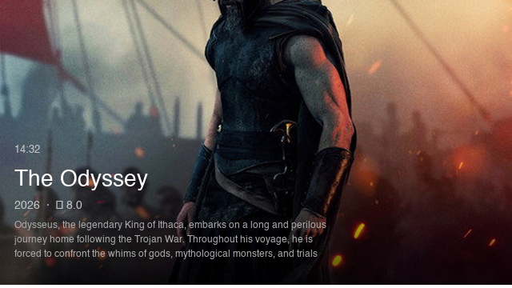
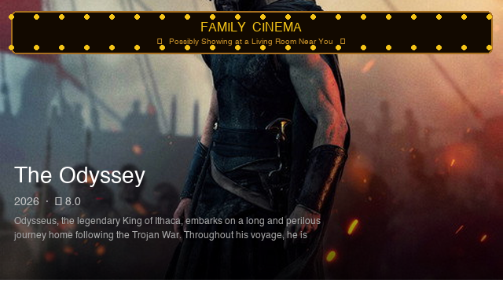
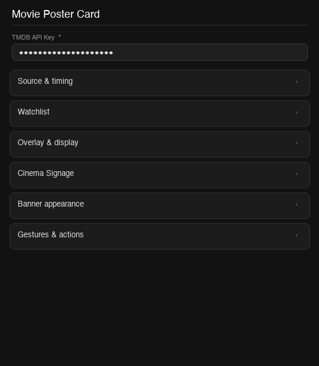
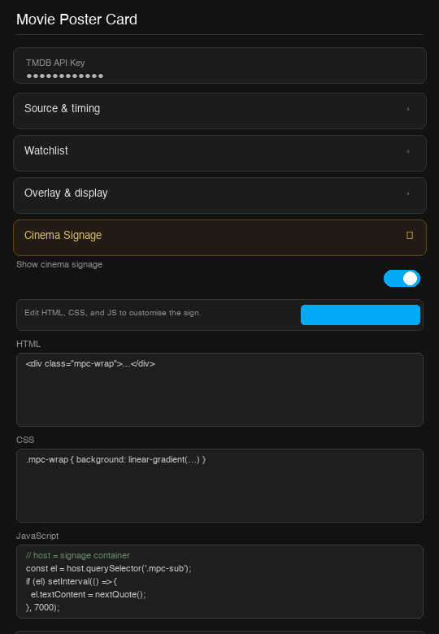

# Movie Poster Card for Home Assistant

A Lovelace custom card that cycles TMDB movie posters on your dashboard — designed for kiosk tablets, wall panels, and TV displays. Features a full visual editor, cinema marquee signage, watchlist integration, and gesture actions.

[](https://github.com/hacs/integration)
[](https://github.com/ian-tait/ha-movie-poster-card/releases)

---

## Screenshots

| Poster with overlay | Cinema signage | Visual editor |
|---|---|---|
|  |  |  |

---

## Features

- **Cycles TMDB movie posters** — Now Playing, Popular, Top Rated, Trending (daily or weekly)
- **Rich overlay** — title, year, TMDB rating, synopsis, progress bar, clock
- **Cinema marquee signage** — fully customisable HTML/CSS/JS sign floating above the poster, pre-loaded with an amber LED-dot cinema board
- **Watchlist integration** — double-tap any poster to add it to a Home Assistant To-do list, with duplicate detection
- **Gesture actions** — tap, double-tap, and hold map to any HA action (navigate, call service, toggle overlay, and more)
- **Full visual editor** — configure everything from the HA dashboard editor without touching YAML
- **Kiosk-friendly** — pairs with [browser-mod](https://github.com/thomasloven/hass-browser_mod) for automation-driven screensaver control
- **Region-aware** — filter `now_playing` results by country code

---

## Installation

### HACS (recommended)

1. In HACS go to **Frontend → Custom repositories**
2. Add `https://github.com/ian-tait/ha-movie-poster-card` as type **Lovelace**
3. Find **Movie Poster Card** and click **Download**
4. Hard-refresh your browser (Cmd+Shift+R / Ctrl+Shift+R)

### Manual

1. Download `movie-poster-card.js` from the [latest release](https://github.com/ian-tait/ha-movie-poster-card/releases/latest)
2. Copy it to `config/www/movie-poster-card.js`
3. In HA go to **Settings → Dashboards → Resources → Add resource**
   - URL: `/local/movie-poster-card.js`
   - Type: **JavaScript module**
4. Hard-refresh your browser

---

## TMDB API Key

This card requires a **free** TMDB API key. Without it no posters will load.

1. Create a free account at [themoviedb.org](https://www.themoviedb.org)
2. Go to **Settings → API → Create → Developer**
3. Copy the **API Key (v3 auth)** string — it looks like `a1b2c3d4e5f6...`
4. Paste it into the card config as `tmdb_api_key`

Your key is only used in your browser to call the TMDB API directly. It is never stored or sent anywhere else.

---

## Minimum config

```yaml
type: custom:movie-poster-card
tmdb_api_key: "your_tmdb_api_key_here"
```

---

## Visual editor

The card ships with a full visual editor — open the dashboard editor, add the card, and configure everything with dropdowns, sliders, and toggles. No YAML required.



---

## Cinema Signage

Enable `show_marquee` to float a cinema board above the poster. The signage is driven by three fields — **HTML**, **CSS**, and **JavaScript** — which you edit directly in the visual editor.

The default design is a classic amber LED-dot cinema marquee with a Cinzel-font title and rotating Dad-joke subtitles. Click **Restore cinema defaults** in the editor at any time to reset back to the built-in design.

To write your own signage, edit the three fields freely. In the JavaScript field, `host` refers to the signage container element:

```javascript
// Example: change the title text dynamically
const title = host.querySelector('.mpc-title');
if (title) title.textContent = 'My Custom Cinema';
```

```yaml
show_marquee: true
# marquee_custom_html, marquee_custom_css, marquee_custom_js
# are managed by the visual editor — or paste your own code below:
marquee_custom_html: |
  <div class="mpc-wrap">
    <div class="mpc-dots"></div>
    <div class="mpc-body">
      <div class="mpc-title">Family Cinema</div>
      <div class="mpc-sub">✦ Now Showing ✦</div>
    </div>
    <div class="mpc-dots"></div>
  </div>
```

---

## Watchlist

Uses the HA [To-do list](https://www.home-assistant.io/integrations/todo/) integration. Create a to-do list first (**Settings → Devices & Services → Add Integration → Local To-do**), then point the card at it.

Double-tap any poster to add the current movie. The card checks for duplicates and shows a brief toast notification.

```yaml
watchlist_entity: todo.family_watchlist
watchlist_item_format: "{title} ({year}) — ★{rating}/10"
watchlist_confirm: true
watchlist_no_duplicates: true
```

Available variables in `watchlist_item_format`: `{title}` `{year}` `{rating}` `{overview}`

---

## Gestures

| Gesture | Default | Description |
|---------|---------|-------------|
| Tap | `none` | Single short press anywhere on the card |
| Double tap | `add-to-watchlist` | Two taps within 300 ms |
| Hold | `none` | Press and hold for 600 ms |

Available action types:

| Action | Description |
|--------|-------------|
| `none` | Do nothing |
| `next` | Advance to the next poster |
| `previous` | Go back to the previous poster |
| `navigate` | Navigate to a dashboard path — requires `navigation_path` |
| `call-service` | Call any HA service — requires `service` and optionally `service_data` |
| `url` | Open a URL in a new tab — requires `url_path` |
| `toggle-info` | Show or hide the text overlay |
| `add-to-watchlist` | Add the current movie to your watchlist |

---

## Full configuration reference

### Source & data

| Option | Type | Default | Description |
|--------|------|---------|-------------|
| `tmdb_api_key` | string | **required** | Your TMDB v3 API key |
| `source` | string | `now_playing` | `now_playing` · `popular` · `top_rated` · `trending_day` · `trending_week` |
| `region` | string | `US` | ISO 3166-1 country code — affects `now_playing` (e.g. `GB`, `AU`, `DE`) |
| `cache_hours` | number | `6` | How often to re-fetch the movie list from TMDB (hours) |

### Display & timing

| Option | Type | Default | Description |
|--------|------|---------|-------------|
| `display_time` | number | `30` | Seconds per poster |
| `transition` | string | `fade` | `fade` · `none` |
| `transition_duration` | number | `1.0` | Transition length in seconds |
| `shuffle` | bool | `true` | Random order |
| `pause_on_hover` | bool | `true` | Pause cycling while the card is hovered |

### Overlay elements

| Option | Type | Default | Description |
|--------|------|---------|-------------|
| `show_overlay` | bool | `true` | Show/hide the entire text overlay |
| `show_title` | bool | `true` | Movie title |
| `show_year` | bool | `true` | Release year |
| `show_rating` | bool | `true` | TMDB vote average |
| `show_synopsis` | bool | `true` | Overview text |
| `synopsis_lines` | number | `3` | Max lines before truncating |
| `show_progress_bar` | bool | `true` | Time-remaining progress bar |
| `progress_bar_position` | string | `bottom` | `bottom` · `top` |
| `show_clock` | bool | `false` | Current time in the overlay |
| `clock_format` | string | `24h` | `24h` · `12h` |

### Banner & overlay appearance

| Option | Type | Default | Description |
|--------|------|---------|-------------|
| `overlay_style` | string | `gradient` | `gradient` · `solid` |
| `overlay_color` | string | `#000000` | Overlay background colour |
| `overlay_opacity` | number | `0.7` | Overlay opacity — `0.0` to `1.0` |
| `overlay_position` | string | `bottom` | `bottom` · `top` · `center` |
| `title_color` | string | `#ffffff` | Title text colour |
| `title_size` | string | `lg` | `sm` · `md` · `lg` · `xl` |
| `title_weight` | string | `bold` | `normal` · `bold` |
| `meta_color` | string | `#cccccc` | Year / rating colour |
| `synopsis_color` | string | `#aaaaaa` | Synopsis text colour |
| `text_shadow` | bool | `true` | Drop shadow on text |

### Cinema Signage

| Option | Type | Default | Description |
|--------|------|---------|-------------|
| `show_marquee` | bool | `false` | Enable the cinema signage panel |
| `marquee_custom_html` | string | *(cinema board)* | HTML content for the signage |
| `marquee_custom_css` | string | *(cinema board)* | CSS scoped to the signage container |
| `marquee_custom_js` | string | *(cinema board)* | JavaScript — `host` is the signage container element |

### Watchlist

| Option | Type | Default | Description |
|--------|------|---------|-------------|
| `watchlist_entity` | string | — | HA to-do list entity ID, e.g. `todo.family_watchlist` |
| `watchlist_item_format` | string | `{title} ({year}) — {rating}/10` | Item template — variables: `{title}` `{year}` `{rating}` `{overview}` |
| `watchlist_confirm` | bool | `true` | Show "Added" toast notification |
| `watchlist_no_duplicates` | bool | `true` | Prevent adding the same movie twice |

### Gestures

| Option | Type | Default | Description |
|--------|------|---------|-------------|
| `tap_action` | action | `none` | Single tap |
| `double_tap_action` | action | `add-to-watchlist` | Double tap |
| `hold_action` | action | `none` | Press and hold (600 ms) |

> **Note:** Swipe gestures are not supported — they conflict with HA's own dashboard navigation. Use tap, double-tap, or hold to trigger `next` / `previous` instead.

---

## Full example config

```yaml
type: custom:movie-poster-card

# Required
tmdb_api_key: "your_tmdb_api_key_here"

# Source
source: now_playing
region: GB
cache_hours: 6

# Timing
display_time: 30
transition: fade
transition_duration: 1.0
shuffle: true
pause_on_hover: true

# Overlay elements
show_overlay: true
show_title: true
show_year: true
show_rating: true
show_synopsis: true
synopsis_lines: 3
show_progress_bar: true
progress_bar_position: bottom
show_clock: true
clock_format: 24h

# Banner appearance
overlay_style: gradient
overlay_color: "#000000"
overlay_opacity: 0.65
overlay_position: bottom
title_color: "#ffffff"
title_size: lg
title_weight: bold
meta_color: "#cccccc"
synopsis_color: "#aaaaaa"
text_shadow: true

# Cinema signage
show_marquee: true

# Watchlist
watchlist_entity: todo.family_watchlist
watchlist_item_format: "{title} ({year}) — ★{rating}/10"
watchlist_confirm: true
watchlist_no_duplicates: true

# Gestures
tap_action:
  action: navigate
  navigation_path: /lovelace/home
double_tap_action:
  action: add-to-watchlist
hold_action:
  action: toggle-info
```

---

## browser-mod setup (kiosk / screensaver)

The card works standalone but pairs naturally with [browser-mod](https://github.com/thomasloven/hass-browser_mod). Create a dedicated **Screensaver** dashboard with this card fullscreen, then drive it from HA automations:

```yaml
# Navigate to screensaver after 5 minutes of no motion
automation:
  - alias: "Screensaver on"
    trigger:
      - platform: state
        entity_id: binary_sensor.lounge_motion
        to: "off"
        for: "00:05:00"
    action:
      - service: browser_mod.navigate
        data:
          path: /lovelace/screensaver

  - alias: "Screensaver off"
    trigger:
      - platform: state
        entity_id: binary_sensor.lounge_motion
        to: "on"
    action:
      - service: browser_mod.navigate
        data:
          path: /lovelace/home
```

---

## License

MIT — see [LICENSE](LICENSE)
